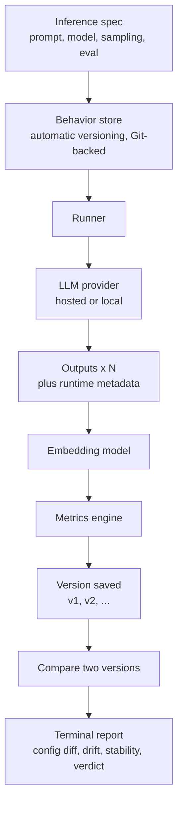
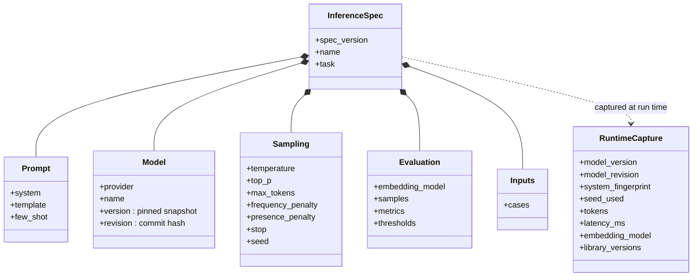
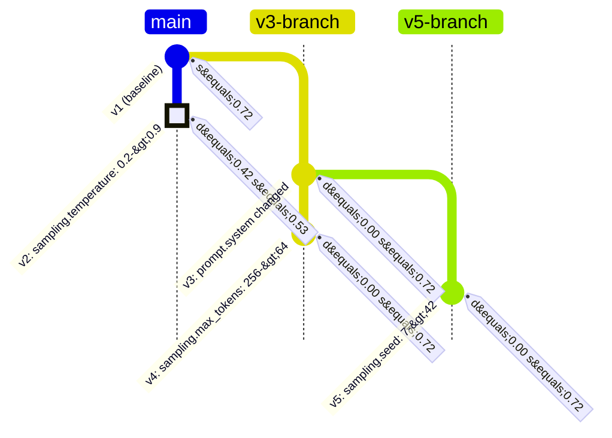

# Drift Observation Workbench

> "We version code, but not AI behavior. This project versions the complete inference specification in Git and measures semantic drift, stability, and regressions across versions, so every behavioral change can be attributed to a specific configuration change."

Goal: Deliver a working command-line tool in under one day that versions the full inference specification, executes it locally, and quantifies how AI behavior differs between two versions while attributing each change to its cause.

---

## 1. Scope

Guiding principle for a one-day build: protect the minimum viable product (MVP) and defer every enhancement to the stretch list.

### MVP (required for the demonstration)
1. Define an inference specification as a single version-controlled file covering the prompt, the model identity and version, the sampling settings, and the evaluation configuration.
2. Execute the specification locally, drawing N samples per version (default N = 3).
3. Record all runtime inference metadata and store the run in Git, keyed to the commit of the specification that produced it.
4. Compare two versions (two Git references) and compute three signals: Output Difference, Semantic Drift, and Stability Score.
5. Present the results in the terminal: the configuration difference, the three metrics, and a verdict of Consistent, Behavior Drift, or Likely Regression.

### Stretch (only after the MVP is stable)
- Multiple test inputs aggregated into a suite-level score.
- Drift trend across more than two versions.
- Token-level difference highlighting.
- A regression gate that returns a non-zero exit code for use in automation.
- Run records stored as Git notes attached to specification commits.

### Out of scope
- A hosted or multi-user web service.
- A public REST API, CORS, or client-server networking.
- Authentication, multi-user support, or a managed database.
- Model fine-tuning.

---

## 2. Architecture

The tool is a single local command-line application with a small, task-oriented command set. Versioning is automatic, and Git is an internal storage backend that users never invoke directly. All execution is local and CLI-first; there is no hosted service or networked API.



Pipeline: versioned specification, then runner, then language model, then outputs with runtime capture, then embedding, then drift and stability, then the behavior store, then terminal report.

The unit of versioning is the inference specification. A version of AI behavior is an automatically captured snapshot - the specification together with its run record - stored durably in the Git-backed behavior store and referred to by a simple name such as v1 or v2. Users never run Git commands.

**Design principle - data-structure agnostic.** dow versions the *specification* and records the *metrics*, and it is deliberately incurious about everything else. It ships no coefficients and no plotting library (the project plugs those in under `evaluation.comparators` / `aggregators` / `plots`); it treats each version's per-item `payload` as an opaque blob it persists but never interprets, and it persists that blob no matter how the project represents it in memory (numpy arrays, sets, dataclasses, and other exotic values degrade to a faithful JSON-native form rather than breaking the capture); and it makes its own built-in text signals optional (`embedding_model: none`) for behavior that is not free text. How the calling project represents, stores, or shapes its data therefore never constrains dow's design. dow's job is to be extremely reliable at tracking what changed - prompt, model, sampling, params - and the metrics the project cares about, and nothing more.

---

## 3. Technology Stack

| Layer | Choice | Rationale |
|---|---|---|
| Command-line interface | Python with Typer and Rich | Rapid development; formatted tables and diffs in the terminal |
| Versioning and storage | Git (via subprocess), hidden behind the tool | Durable, recoverable version history with no version-control commands for the user |
| Inference | A provider interface over a hosted model (OpenAI) or a local runtime (Ollama or a vLLM server, local or remote), with a mock mode | Enables fully local or offline operation and isolates the model behind one interface |
| Embeddings | Built-in hashing embedder by default; sentence-transformers or a hosted model optionally | Required for semantic drift; the default keeps the tool fully offline with no model download |
| Metrics | numpy and difflib | Cosine similarity, variance, and text difference |
| Specification format | YAML (PyYAML) | Human-readable and diff-friendly under version control |

The language model and the embedder sit behind a single provider interface that includes a deterministic mock mode. This permits development without credentials and a reliable offline demonstration.

---

## 4. Versioned Inference Specification

Every input that determines model behavior at runtime is recorded so that no variable is left untracked. This is the foundation for establishing causality (Section 8).

A specification is a single YAML file you edit:

```yaml
# specs/summarization.yaml — a fully versioned inference specification
spec_version: 1
name: summarization
task: Summarize a customer support ticket

# operation: ""                   # optional: label a non-generation op (relabel, recluster, subsample, ...)
# params: {}                      # optional: free-form perturbation params — fingerprinted and diff-attributed

prompt:
  system: You are an assistant that writes concise summaries.
  template: |
    Summarize the following ticket:

    {input}
  few_shot: []

model:
  provider: mock                    # mock | openai | ollama | vllm
  name: mock-summarizer
  version: mock-2024-07-18          # pinned snapshot, never a floating alias
  revision: null                    # model commit or revision hash for open-weight models

sampling:
  temperature: 0.2
  top_p: 1.0
  max_tokens: 256
  frequency_penalty: 0.0
  presence_penalty: 0.0
  stop: null
  seed: 7                           # pinned for reproducibility

evaluation:
  embedding_model: hashing-256      # text default; a sentence-transformers id; or 'none' if outputs aren't text
  samples: 5                        # N samples per version, used for stability
  metrics:                          # your own evaluators (path.py:function)
    - evals.py:avg_word_count
    - evals.py:mentions_order_id
  comparators:                      # your own paired baseline-vs-variant metrics (path.py:function)
    - metrics.py:weighted_kappa
  aggregators:                      # your own N-way metrics over a COHORT of versions (path.py:function)
    - metrics.py:seed_reliability
  plots:                            # your own plot functions; dow stores the figures (ships no matplotlib)
    - plots.py:forest_plot
  thresholds:
    drift_warn: 0.15
    drift_fail: 0.40

inputs:
  - "My order #123 never arrived and support has not replied in a week."
```

Tracked fields, by category:
- Prompt: the system prompt, the user template, and any few-shot examples.
- Model identity: the provider, the model name, a pinned model version or snapshot, and, for open-weight models, the model commit or revision hash. Floating aliases are prohibited because they change silently.
- Operation and params (optional): a label for a non-generation perturbation (relabel, recluster, subsample, ...) and a free-form parameter block; both are fingerprinted and attributed like any other field, so a re-analysis is a versioned single-field change.
- Sampling and decoding: temperature, top_p, maximum tokens, penalties, stop sequences, and the random seed.
- Evaluation configuration: the embedding model, the sample count, the verdict thresholds, the single-version evaluators (`metrics`), the paired comparators (`comparators`), the N-way cohort aggregators (`aggregators`), and the plot functions (`plots`).
- Inputs: the test input or inputs — a literal string, or an `{artifact: path, sha256: ...}` reference whose on-disk content hash is captured for reproducibility.

### What is tracked

The specification you write and the runtime capture recorded at execution together cover every input to inference:



Everything above the runtime boundary lives in the specification file you edit; the runtime capture is recorded automatically at execution and saved alongside it as part of the version.

---

## 5. Runtime Capture and Git Storage

Execution records every observable property of the inference at runtime. The run record is saved as a named version in the Git-backed behavior store, linked to the exact specification that produced it.

Run record, saved as `.dow/versions/<spec-name>/v2.json`:

```json
{
  "spec": "summarization",
  "spec_fingerprint": "95d90d8547cd",
  "run_id": "2026-06-24T10:15:00Z-01",
  "runtime": {
    "provider": "mock",
    "model_name": "mock-summarizer",
    "model_version": "mock-2024-07-18",
    "model_revision": null,
    "system_fingerprint": "fp_mock_6ca75b37",
    "seed": 7,
    "embedding_model": "hashing-256",
    "library_versions": { "python": "3.12.10", "numpy": "2.5.0" }
  },
  "samples": [
    { "output": "...", "tokens": 14, "latency_ms": 1 }
  ],
  "metrics": { "stability": 0.72 }
}
```

Captured runtime fields include the resolved model version and revision, the provider's system fingerprint (which detects server-side model changes), the seed actually used, token usage and latency per sample, the embedding model, and the versions of the libraries involved.

Repository layout, with Git as the backend:

```
specs/
  summarization.yaml          # the spec you edit (the working version)
.dow/                       # hidden, Git-backed behavior store
  index.json                  # version list per spec
  versions/
    summarization/
      v1.json                 # captured spec, outputs, runtime metadata, metrics
      v2.json
```

Because versions are ordinary files under `.dow`, the Git backend provides durable, recoverable history for free. Users never run Git; they refer to versions by simple names such as `v1` and `v2`, and the tool reads the records directly.

---

## 6. Metric Definitions

Outputs are embedded as vectors and compared with cosine similarity, cos(a, b) = (a . b) / (||a|| ||b||).

- Output Difference (text level): diff = 1 - SequenceMatcher(text_a, text_b).ratio(), where 0 indicates identical text and 1 indicates entirely different text.

- Semantic Drift (meaning level), the distance between the mean embedding of each version's outputs:
  $$\text{drift} = 1 - \cos\big(\bar{e}_{A},\ \bar{e}_{B}\big), \qquad \bar{e}_{V} = \frac{1}{N}\sum_{i=1}^{N} e_{V,i}$$
  Low drift indicates unchanged behavior; high drift indicates changed behavior.

- Stability Score (consistency of one version across N samples), the mean pairwise self-similarity:
  $$\text{stability}_V = \frac{2}{N(N-1)} \sum_{i<j} \cos\big(e_{V,i},\, e_{V,j}\big)$$
  A high score indicates reliable, repeatable output; a low score indicates variable output.

- Verdict, using the thresholds defined in the specification:
  - drift below 0.15: Consistent
  - drift from 0.15 up to 0.40: Behavior Drift
  - drift of 0.40 or above, or a substantial decrease in stability: Likely Regression

These built-in signals assume the output is text and are computed with an embedding model. A project whose captured behavior is not free text sets `embedding_model: none`; dow then omits output difference, semantic drift, stability, and the verdict, and reports the configuration difference together with the project's own pluggable metrics (below) instead. dow never requires its built-ins to be meaningful for the project's data - they are a convenience default for text outputs, not an assumption baked into the design.

### Custom evaluators (pluggable metrics)

Beyond the built-in signals, users plug in their own metrics. An evaluator is a plain Python callable that receives an `EvalContext` (the input, the sampled outputs, the config, and the runtime capture) and returns a score or a dict of named scores. Evaluators are referenced from the spec under `evaluation.metrics`:

```yaml
evaluation:
  metrics:
    - evals.py:avg_word_count        # local file : function
    - my_pkg.metrics:accuracy        # importable module : function
```

```python
# evals.py
def avg_word_count(ctx):
    counts = [len(o.split()) for o in ctx.outputs]
    return sum(counts) / len(counts) if counts else 0.0
```

`dow eval` runs the configured evaluators, saves the scores into the version record so they travel with the commit, and reports them against the previous version and the last version tagged as good. Evaluation runs automatically on `dow commit` and is lazy thereafter: saved results are reused unless `--rerun` is passed. Any version can be labelled with `dow tag` (for example `good`, `golden`, `baseline`), and `dow eval --good-tag <label>` selects which label marks the known-good baseline.

### Paired comparators (baseline-vs-variant metrics)

Some metrics are inherently *paired*: they score one version **against another**, aligned item by item — inter-rater agreement and reliability coefficients (weighted Cohen's kappa, Krippendorff's alpha, Gwet AC1/AC2, ICC, PABAK, flip rate) and their bootstrap confidence intervals. A single-version evaluator cannot express these, because it never sees the baseline. Comparators are the paired counterpart of evaluators, and — exactly like evaluators — **dow ships none of the coefficients itself**: the project brings its own callables and plugs them in under `evaluation.comparators`:

```yaml
evaluation:
  comparators:
    - metrics.py:weighted_kappa       # local file : function
    - my_pkg.agreement:krippendorff   # importable module : function
```

A comparator receives a `CompareContext` with both captured versions (`a` = baseline, `b` = variant), each exposing its per-item `payload` (below) plus the flattened config diff. It returns either a plain number, a `{estimate, ci_low, ci_high}` band, or a bag of named metrics; dow stores the value verbatim without interpreting it.

```python
# metrics.py
def flip_rate(cctx):
    a, b = cctx.a.payload["labels"], cctx.b.payload["labels"]
    return sum(x != y for x, y in zip(a, b)) / len(a)
```

Comparators are computed on demand by `dow compare` and `dow explain` (not persisted into the commit), so the same attribution that pins a behavioral change to a single configuration field also reports how far the paired coefficient moved, with its confidence interval. A comparator failure is captured and reported, never fatal.

Structured, per-item data is carried by an optional **`payload`**: whatever a `python` provider returns alongside its text output (for example an aligned vector of ordinal labels) is exposed to evaluators as `ctx.payload` and to comparators as `cctx.a.payload` / `cctx.b.payload`. Because such data can be large and would bloat the version history, dow does not inline it in the version JSON: it is written once, keyed by its content hash, under `.dow/artifacts/` (git-ignored) and referenced from the record. It is rehydrated transparently on read and verified against its hash, so the git-tracked history stays light while every record remains reproducible. A non-generation perturbation can additionally be labelled with a fingerprinted `operation` and free-form `params` block (see Section 4), so a re-analysis (relabel, recluster, subsample) is versioned and attributed like any other single-field change.

### N-way cohort aggregators (reliability over a set of versions)

A comparator sees exactly two versions, but many robustness questions are inherently **N-way**: the agreement of an ordinal label across *K* random seeds, *K* judge models, *K* prompt wordings, or *K* clustering permutations (ICC, Fleiss's kappa, Gwet AC2, Krippendorff's alpha over K raters, each with a question-level bootstrap CI). These consume a whole **cohort** at once, not a pair. **Aggregators** are the many-version generalization of comparators, plugged in under `evaluation.aggregators`; as always, **dow ships none of the coefficients**:

```yaml
evaluation:
  aggregators:
    - metrics.py:seed_reliability     # ICC / AC2 / Krippendorff alpha over K seeds
```

An aggregator receives a `CohortContext` whose `members` is one `EvalContext` per version — each with its per-item `payload` — so the project aligns them by its own key (for example a question id) and computes the coefficient over all K raters, doing any clustered bootstrap itself. It returns the same structured shapes as a comparator (a number, an `{estimate, ci_low, ci_high}` band, or a table of rows), stored verbatim.

`dow aggregate` selects the cohort — an explicit list of versions, every version carrying a `--tag`, or the whole history — runs the aggregators, and **persists the result as a durable, git-tracked bundle** under `.dow/aggregations/` (recording the member ids, their fingerprints, the coefficient values, any figures, and a timestamp). A robustness check therefore becomes a citable, reproducible object; `dow aggregate --list` and `--show <id>` retrieve past bundles. Aggregator failures are captured and reported, never fatal.

### Cross-spec suites (the matrix)

`dow aggregate` operates within a **single** spec. A robustness sweep, though, is frequently a **matrix** — the same check run across several models, domains, or temperatures, where each cell of the matrix is its own spec. **`dow suite`** aggregates versions drawn from **several** specs at once, so the whole matrix collapses into one citable object. The participating specs and the project's own aggregators/plots are declared in a manifest, `specs/<name>.suite.yaml` (a distinct suffix that keeps suites out of the inference-spec code paths, so a manifest never leaks into `dow history` or single-spec resolution):

```yaml
# specs/robustness_matrix.suite.yaml
name: robustness_matrix
specs: [check_llama, check_qwen, check_mistral]   # specs to draw versions from
select: all              # all | latest | <tag>
evaluation:
  aggregators: [suite_metrics.py:agg_matrix]      # your callables; dow ships none
  plots: [suite_plots.py:plot_matrix]
```

Every member keeps its own captured `config`, and the `CohortContext` gains a parallel **`specs`** list naming each member's spec, so a suite aggregator can bucket by spec / model / domain / temperature. Member ids are composite `spec:version`. `select` chooses the cohort: `all` (every version of each listed spec — the full matrix), `latest` (each spec's newest version), or a tag name (each spec's versions carrying that tag; specs with no match are skipped, and an entirely empty selection is a clear error). Suite runs persist as durable, git-tracked bundles under `.dow/aggregations/_suites/<name>/` — a **separate namespace** from single-spec aggregations — and `dow suite --list`, `--show <id>`, and `--plot` mirror `dow aggregate`. The suite reuses the same aggregator/plot contract, so **dow still ships none of the coefficients or plotting code**.

### Pluggable plots (figures as content-addressed artifacts)

dow can turn any of these results into a figure without shipping a plotting library. The project references its own plot functions under `evaluation.plots`; each receives a `PlotContext` carrying the analysis `results` to render and a dow-provided `out_dir` to write into, and returns the path(s) of the figure file(s) it produced:

```yaml
evaluation:
  plots:
    - plots.py:forest_plot            # your matplotlib (or any) code; dow ships none
```

Run with `dow compare --plot`, `dow aggregate --plot`, `dow suite --plot`, or `dow trend --plot`. dow copies each produced file into the content-addressed artifact store (`.dow/artifacts/`, git-ignored, like payloads), records its `sha256`, byte size, and original filename in the result, and — for an aggregation — references it from the persisted bundle so the figure is integrity-checkable and regenerable. The figure bytes stay out of the git history; only the light reference travels with the commit. A plot failure is captured and reported, never fatal.

### Longitudinal trend and the regression gate (orchestration only)

Two additions that read the numbers dow already records — they compute nothing new, keeping dow metric-free.

**`dow trend`** is the longitudinal complement to the pairwise `dow compare`: it follows one metric (or every numeric metric) across a spec's **whole** version history in commit order, so a slow drift over many iterations — invisible to any single pairwise hop — becomes plain. Each version's value is reported with its change since the previous version and since the baseline (v1), and each hop is labelled `baseline` / `same-config` / `config-changed` using the same fingerprint-vs-previous logic as `dow history`. Both the built-in text `stability` and the project's own `evaluation.metrics` scores are trended; `--metric` focuses on one and `--plot` hands the series to `evaluation.plots` (`kind="trend"`). A metric missing on some versions yields a null point, and deltas are measured against the last non-null value.

**The regression gate** turns a comparison or an evaluation into a process exit code so a sweep or CI job fails fast. `dow compare --fail-on-regression` exits non-zero when the built-in verdict is a likely regression; `--fail-on-drift` is stricter (behavior drift or worse). `dow eval --metric NAME --min X --max Y` gates on a project-supplied score and **fails closed** — a missing or non-numeric value where a bound is set is a breach, so a gate never silently passes when the metric it guards has vanished (this also works with `--draft`, to reject a bad working spec before committing). With `embedding_model: none` the verdict is null and never trips; gate on a project metric instead. The gate is a pure decision (`verdict_gate` / `threshold_gate` in the service), so it is independently testable and identical across the CLI and the MCP surface.

---

## 7. Command-Line Interface

The commands are task-oriented, not version-control plumbing. Versioning is automatic: every commit captures a named version (`v1`, `v2`, and so on). There is no staging or refs to learn, and Git stays hidden as the storage backend; `dow init` only scaffolds a starter spec.

| Command | Purpose |
|---|---|
| `dow init` | Scaffold a starter spec and evals.py to begin versioning |
| `dow commit` | Run the specification and capture its behavior as a new version |
| `dow compare [A] [B]` | Compare two versions - output difference, semantic drift, stability, verdict (defaults to the last two) |
| `dow explain [A] [B]` | Explain why behavior changed: attribute it to the configuration difference (Section 8) |
| `dow history` | List captured versions and their stability |
| `dow inspect [version]` | Show one version's specification, runtime capture, and outputs |
| `dow tag <label> [version]` | Tag a version with a free-form label: good, golden, baseline, bad, ... |
| `dow eval [version]` | Run custom evaluators; compare scores against the previous and last-good versions |
| `dow aggregate [VERSIONS]` | Aggregate reliability metrics over a cohort of versions (N-way); persist a git-tracked bundle, optionally with figures (`--plot`) |
| `dow suite [NAME]` | Aggregate versions across several specs (a cross-spec matrix declared in `specs/<name>.suite.yaml`); persist a git-tracked bundle, optionally with figures (`--plot`) |
| `dow trend` | Follow a metric across a spec's whole version history (tree-aware); the built-in `stability` and the project's own scores, each with its change vs. the previous version and the baseline, optionally plotted (`--plot`) |
| `dow tree` | Visualize evolution: a vertical trunk with branches, as a terminal tree or an exported Mermaid `gitGraph` |

Versions are referred to by simple names (`v1`, `v2`), the shortcuts `last` and `prev`, or any label applied with `dow tag` (for example `good`). They form a tree: every commit records its parent, and `dow commit --from v1` starts a new branch from an earlier version. Command output is rendered in the terminal.

Example session:

```
$ dow init
Created specs/summarization.yaml, evals.py. Edit specs/summarization.yaml, then run dow commit to capture v1.

$ dow commit
Captured v1   stability 0.72

# raise the temperature in specs/summarization.yaml

$ dow commit
Captured v2   stability 0.53

$ dow compare
summarization   v1 vs v2
What changed in the configuration
  sampling.temperature: 0.2 -> 0.9
Output difference: 0.61
Semantic drift:    0.42  (warn 0.15, fail 0.40)
Stability v1: 0.72    Stability v2: 0.53
Verdict: Likely Regression

$ dow explain
Cause:  sampling.temperature (0.2 -> 0.9)
Effect: semantic drift 0.42, stability change -0.19 -> Likely Regression
```

### Visualizing evolution

`dow tree` renders the version history with the main line as a vertical trunk and each derivative branch (and sub-branch) running alongside it, in chronological order. `dow tree -o evolution.md` exports the same as a Mermaid `gitGraph`; commits are tagged with drift (`d`) and stability (`s`), and regressions are highlighted:



The trunk `v1 -> v2` is the main line; `v3-branch` forks from v1 and continues to v4, and `v5-branch` is a sub-branch off v3. Raising the temperature (v2) regressed stability and is highlighted; under the offline mock embedder the other edits register no drift, whereas a real model and embedding model would surface drift on each.

### Programmatic and MCP surface

The command line is one front end over a headless core (`dow/service.py`); an AI agent gets the same workflow over the Model Context Protocol. The `dow-mcp` server (install with the `mcp` extra) exposes sixteen tools mirroring the commands above - scaffold, read/write a spec, commit, compare, explain, eval, aggregate, aggregate across specs (suite), trend, tag, history, inspect, tree, and docs - plus read-only resources (`dow://overview`, `dow://docs/<command>`, `dow://specs`, `dow://spec/<name>`) an agent can attach as context. `dow_compare` takes a `fail_on` argument that returns a structured regression-gate decision. Because both surfaces call the same core, they never drift apart, and both are data-structure agnostic: when a spec sets `embedding_model: none`, the built-in drift, stability, and verdict come back null (`driftEnabled` is false) and the configuration diff plus the project's own metrics carry the analysis. dow itself still ships no metric, statistic, or plotting code.

---

## 8. Establishing Causality

Model behavior is a function of the complete inference specification plus irreducible sampling noise. When every input is versioned, the only unexplained variation between two runs of the same specification is sampling noise, which the Stability Score measures directly. This makes behavioral change attributable rather than mysterious.

Principles:
- Total capture: the prompt, the model identity and version, the sampling settings, the evaluation configuration, the inputs, and the library versions are all recorded. Nothing that influences behavior is left outside version control.
- Attribution: when metrics change between two references, the tool computes the specification difference and presents the behavioral delta beside the configuration delta. When exactly one field changed, that field is the cause.
- Controlled comparison: to support a rigorous causal claim, vary a single field per commit. When more than one field differs, the tool marks the comparison as confounded and lists every change.
- Determinism controls: pin the seed and pin the model snapshot version, and avoid floating aliases that update silently. Record the provider's system fingerprint to detect server-side model changes that would otherwise appear as unexplained drift.
- Behavior versus evaluation: because the evaluation configuration is versioned alongside the model configuration, a change in measured results can be correctly attributed either to a change in behavior or to a change in how behavior is measured.

This attribution capability is the central contribution. It converts an opaque observation, that the output changed, into a precise statement, that the output changed because a specific configuration value changed.

---

## 9. Hour-by-Hour Timeline

Approximately eight to nine hours, organized by component and parallelizable across two to four contributors.

| Time | Versioning and runtime | Metrics and interface |
|---|---|---|
| 0:00-1:00 | Specification schema; behavior store (automatic versioning, Git-backed) | Scaffold the CLI with Typer and Rich; implement the mock provider |
| 1:00-2:30 | Runner: N samples and full runtime capture; `dow commit` end to end | Embedding integration with batched calls |
| 2:30-3:30 | Version resolution and record lookup; seed example specifications | Metrics engine: difference, drift, stability, verdict |
| 3:30-4:30 | Specification diff between versions | `dow compare` report rendering in the terminal |
| 4:30-6:00 | `dow explain` attribution and confounded-comparison detection | `dow history` and `dow inspect` |
| 6:00-7:00 | Edge cases; threshold tuning; prepare a clear demonstration example | Output polish: tables, colors, and wording |
| 7:00-8:00 | Stretch: Git notes or multiple inputs | Stretch: drift trend across versions |
| 8:00-9:00 | Demonstration rehearsal and buffer | Demonstration rehearsal |

Enforce strict time boxes. If a component is not working by hour five, fall back to mock mode and preserve the demonstration.

---

## 10. Roles

- Versioning and runtime: the specification schema, the Git layer, the runner, and runtime capture.
- Metrics and causality: difference, drift, stability, thresholds, and the attribution view.
- Interface: the command-line commands, terminal rendering, and output polish.
- Presentation: the slide deck, the demonstration script, and time-keeping; assists other contributors as needed.

For a single contributor, implement the components in MVP order and rely on mock mode early.

---

## 11. Risks and Mitigations

| Risk | Mitigation |
|---|---|
| Credentials, rate limits, or cost | Use a small model, a small sample count, caching, mock mode, or a local model |
| Network failure during the demonstration | Use a local model or mock mode with seeded outputs, and pre-record a run |
| Embedding latency | Batch all embedding calls and use a small local embedding model |
| Metrics appear unconvincing | Select a specification pair with an obvious behavioral change for the demonstration |
| A confounded comparison undermines a causal claim | Enforce single-variable changes per commit and surface confounds explicitly |
| Scope creep | Freeze the stretch list until the MVP demonstrates cleanly |

---

## 12. Demonstration Script (approximately two minutes)

1. Context: code has Git, but AI behavior has no equivalent versioning layer.
2. Run the specification with `dow commit`; show the captured version (v1) and its stability.
3. Change a single field, for example the temperature, and run `dow commit` again to capture v2.
4. Run `dow compare` and `dow explain`: semantic drift rises and stability falls, attributed to the single configuration change.
5. Close: the tool versions the entire inference specification and attributes every behavioral change to a specific configuration change.

---

## 13. Quickstart

```bash
# Install
python -m venv .venv
.venv\Scripts\activate            # Windows
pip install -e .
pip install -e ".[openai]"        # optional, for hosted models
pip install -e ".[local]"         # optional, for local sentence-transformers embeddings

# Capture and compare versions (versioning is automatic)
dow init                # scaffold an example spec
dow commit              # captures v1
# change one field in specs/summarization.yaml (for example, temperature), then:
dow commit              # captures v2
dow compare             # v1 vs v2
dow explain             # what caused the change
```

The tool runs entirely offline by default (mock provider and a built-in hashing embedder). Set the provider to a local runtime (Ollama, or a vLLM server via `VLLM_BASE_URL` - local or remote) for open-weight models, or supply `OPENAI_API_KEY` only when using a hosted model.

---

## 14. Definition of Done (MVP)

- [ ] A specification captures the prompt, the model identity and version, the sampling settings, and the evaluation configuration.
- [ ] Execution records runtime metadata (model version and revision, system fingerprint, seed, library versions) and saves the version durably in the Git-backed store.
- [ ] `dow compare` reports the configuration difference, output difference, semantic drift, stability, and a verdict.
- [ ] `dow explain` attributes a behavioral change to the configuration difference and flags confounded comparisons.
- [ ] `dow tree` visualizes the version evolution (terminal tree and exported Mermaid), with branches via `dow commit --from`.
- [ ] Users can plug in custom evaluators (`evaluation.metrics`); `dow eval` runs them lazily, saves the scores with the version, and compares against the previous and last-good versions.
- [ ] Users can plug in paired comparators (`evaluation.comparators`), N-way cohort aggregators (`evaluation.aggregators`) surfaced by `dow aggregate` as durable git-tracked bundles, cross-spec suites (`specs/<name>.suite.yaml`) surfaced by `dow suite`, and plot functions (`evaluation.plots`) whose figures dow stores as content-addressed artifacts — dow shipping none of the coefficients or plotting code.
- [ ] `dow trend` follows a metric across a spec's whole version history (tree-aware, built-in stability and project scores, deltas vs. previous and baseline); `dow compare --fail-on-regression`/`--fail-on-drift` and `dow eval --metric --min/--max` gate sweeps/CI with a non-zero exit code (the metric gate failing closed), computing no new numbers.
- [ ] `dow tag` applies free-form labels (good, golden, baseline, ...) that are usable as version references.
- [ ] The tool runs end to end offline through mock or local mode.
- [ ] A rehearsed two-minute demonstration that lands the closing statement.
