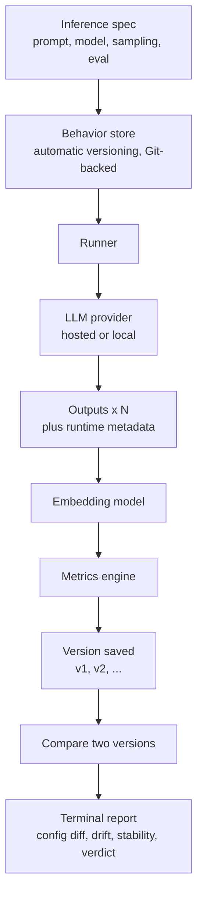
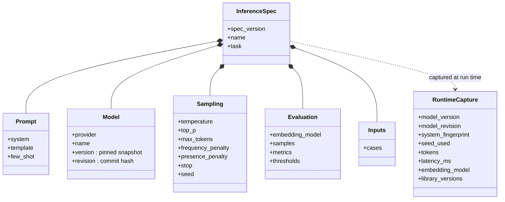
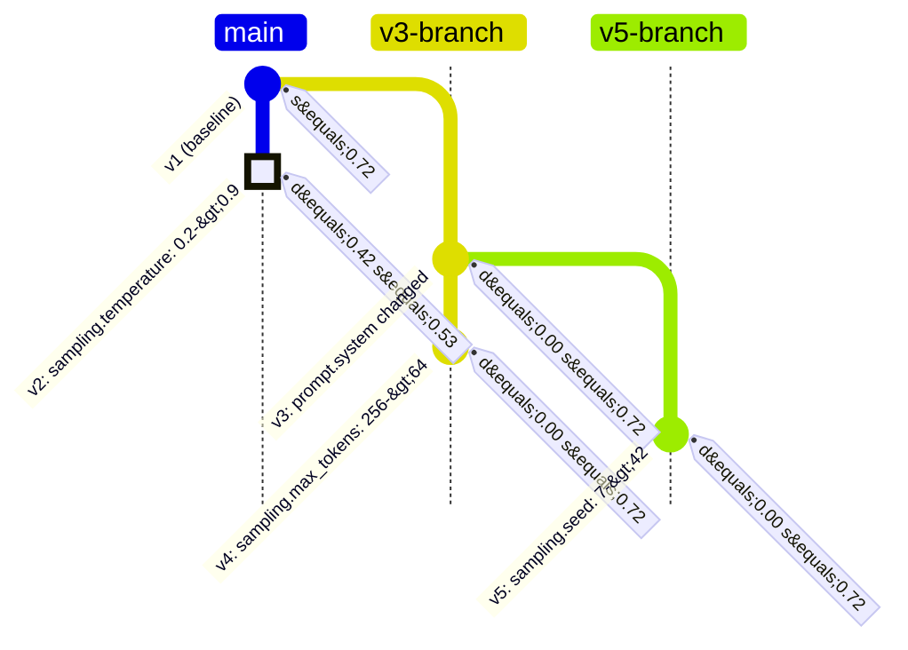

# Drift Observation Workbench

> "We version code, but not AI behavior. This project versions the complete inference specification in Git and measures semantic drift, stability, and regressions across versions, so every behavioral change can be attributed to a specific configuration change."

Goal: Deliver a working command-line tool in under one day that versions the full inference specification, executes it locally, and quantifies how AI behavior differs between two versions while attributing each change to its cause.

---

## 1. Scope

Guiding principle for a one-day build: protect the minimum viable product (MVP) and defer every enhancement to the stretch list.

### MVP (required for the demonstration)
1. Define an inference specification as a single version-controlled file covering the prompt, the model identity and version, the sampling settings, and the evaluation configuration.
2. Execute the specification locally, drawing N samples per version (default N = 3).
3. Record all runtime inference metadata and store the run in Git, keyed to the commit of the specification that produced it.
4. Compare two versions (two Git references) and compute three signals: Output Difference, Semantic Drift, and Stability Score.
5. Present the results in the terminal: the configuration difference, the three metrics, and a verdict of Consistent, Behavior Drift, or Likely Regression.

### Stretch (only after the MVP is stable)
- Multiple test inputs aggregated into a suite-level score.
- Drift trend across more than two versions.
- Token-level difference highlighting.
- A regression gate that returns a non-zero exit code for use in automation.
- Run records stored as Git notes attached to specification commits.
- A local web dashboard for browsing versions, drift, and verdicts, plus editing the spec and capturing versions from the UI (implemented: `dow dashboard`).

### Out of scope
- A hosted or multi-user web service (the `dow dashboard` viewer is local, bound to localhost, and only accepts edits from the local machine).
- A public REST API, CORS, or client-server networking beyond the local dashboard's localhost JSON feed.
- Authentication, multi-user support, or a managed database.
- Model fine-tuning.

---

## 2. Architecture

The tool is a single local command-line application with a small, task-oriented command set. Versioning is automatic, and Git is an internal storage backend that users never invoke directly. All execution is local and CLI-first; the optional `dow dashboard` command adds a local web viewer (a localhost-only server that serves the store as JSON and accepts spec edits/captures from the local machine only), but there is no hosted service or networked API.



Pipeline: versioned specification, then runner, then language model, then outputs with runtime capture, then embedding, then drift and stability, then the behavior store, then terminal report.

The unit of versioning is the inference specification. A version of AI behavior is an automatically captured snapshot - the specification together with its run record - stored durably in the Git-backed behavior store and referred to by a simple name such as v1 or v2. Users never run Git commands.

---

## 3. Technology Stack

| Layer | Choice | Rationale |
|---|---|---|
| Command-line interface | Python with Typer and Rich | Rapid development; formatted tables and diffs in the terminal |
| Versioning and storage | Git (via subprocess), hidden behind the tool | Durable, recoverable version history with no version-control commands for the user |
| Inference | A provider interface over a hosted model (OpenAI) or a local runtime (Ollama), with a mock mode | Enables fully local or offline operation and isolates the model behind one interface |
| Embeddings | Built-in hashing embedder by default; sentence-transformers or a hosted model optionally | Required for semantic drift; the default keeps the tool fully offline with no model download |
| Metrics | numpy and difflib | Cosine similarity, variance, and text difference |
| Specification format | YAML (PyYAML) | Human-readable and diff-friendly under version control |

The language model and the embedder sit behind a single provider interface that includes a deterministic mock mode. This permits development without credentials and a reliable offline demonstration.

---

## 4. Versioned Inference Specification

Every input that determines model behavior at runtime is recorded so that no variable is left untracked. This is the foundation for establishing causality (Section 8).

A specification is a single YAML file you edit:

```yaml
# specs/summarization.yaml — a fully versioned inference specification
spec_version: 1
name: summarization
task: Summarize a customer support ticket

prompt:
  system: You are an assistant that writes concise summaries.
  template: |
    Summarize the following ticket:

    {input}
  few_shot: []

model:
  provider: mock                    # mock | openai | ollama
  name: mock-summarizer
  version: mock-2024-07-18          # pinned snapshot, never a floating alias
  revision: null                    # model commit or revision hash for open-weight models

sampling:
  temperature: 0.2
  top_p: 1.0
  max_tokens: 256
  frequency_penalty: 0.0
  presence_penalty: 0.0
  stop: null
  seed: 7                           # pinned for reproducibility

evaluation:
  embedding_model: hashing-256      # offline default; swap for a sentence-transformers id
  samples: 5                        # N samples per version, used for stability
  metrics:                          # your own evaluators (path.py:function)
    - evals.py:avg_word_count
    - evals.py:mentions_order_id
  thresholds:
    drift_warn: 0.15
    drift_fail: 0.40

inputs:
  - "My order #123 never arrived and support has not replied in a week."
```

Tracked fields, by category:
- Prompt: the system prompt, the user template, and any few-shot examples.
- Model identity: the provider, the model name, a pinned model version or snapshot, and, for open-weight models, the model commit or revision hash. Floating aliases are prohibited because they change silently.
- Sampling and decoding: temperature, top_p, maximum tokens, penalties, stop sequences, and the random seed.
- Evaluation configuration: the embedding model, the sample count, and the verdict thresholds.
- Inputs: the test input or inputs.

### What is tracked

The specification you write and the runtime capture recorded at execution together cover every input to inference:



Everything above the runtime boundary lives in the specification file you edit; the runtime capture is recorded automatically at execution and saved alongside it as part of the version.

---

## 5. Runtime Capture and Git Storage

Execution records every observable property of the inference at runtime. The run record is saved as a named version in the Git-backed behavior store, linked to the exact specification that produced it.

Run record, saved as `.dow/versions/<spec-name>/v2.json`:

```json
{
  "spec": "summarization",
  "spec_fingerprint": "95d90d8547cd",
  "run_id": "2026-06-24T10:15:00Z-01",
  "runtime": {
    "provider": "mock",
    "model_name": "mock-summarizer",
    "model_version": "mock-2024-07-18",
    "model_revision": null,
    "system_fingerprint": "fp_mock_6ca75b37",
    "seed": 7,
    "embedding_model": "hashing-256",
    "library_versions": { "python": "3.12.10", "numpy": "2.5.0" }
  },
  "samples": [
    { "output": "...", "tokens": 14, "latency_ms": 1 }
  ],
  "metrics": { "stability": 0.72 }
}
```

Captured runtime fields include the resolved model version and revision, the provider's system fingerprint (which detects server-side model changes), the seed actually used, token usage and latency per sample, the embedding model, and the versions of the libraries involved.

Repository layout, with Git as the backend:

```
specs/
  summarization.yaml          # the spec you edit (the working version)
.dow/                       # hidden, Git-backed behavior store
  index.json                  # version list per spec
  versions/
    summarization/
      v1.json                 # captured spec, outputs, runtime metadata, metrics
      v2.json
```

Because versions are ordinary files under `.dow`, the Git backend provides durable, recoverable history for free. Users never run Git; they refer to versions by simple names such as `v1` and `v2`, and the tool reads the records directly.

---

## 6. Metric Definitions

Outputs are embedded as vectors and compared with cosine similarity, cos(a, b) = (a . b) / (||a|| ||b||).

- Output Difference (text level): diff = 1 - SequenceMatcher(text_a, text_b).ratio(), where 0 indicates identical text and 1 indicates entirely different text.

- Semantic Drift (meaning level), the distance between the mean embedding of each version's outputs:
  $$\text{drift} = 1 - \cos\big(\bar{e}_{A},\ \bar{e}_{B}\big), \qquad \bar{e}_{V} = \frac{1}{N}\sum_{i=1}^{N} e_{V,i}$$
  Low drift indicates unchanged behavior; high drift indicates changed behavior.

- Stability Score (consistency of one version across N samples), the mean pairwise self-similarity:
  $$\text{stability}_V = \frac{2}{N(N-1)} \sum_{i<j} \cos\big(e_{V,i},\, e_{V,j}\big)$$
  A high score indicates reliable, repeatable output; a low score indicates variable output.

- Verdict, using the thresholds defined in the specification:
  - drift below 0.15: Consistent
  - drift from 0.15 up to 0.40: Behavior Drift
  - drift of 0.40 or above, or a substantial decrease in stability: Likely Regression

### Custom evaluators (pluggable metrics)

Beyond the built-in signals, users plug in their own metrics. An evaluator is a plain Python callable that receives an `EvalContext` (the input, the sampled outputs, the config, and the runtime capture) and returns a score or a dict of named scores. Evaluators are referenced from the spec under `evaluation.metrics`:

```yaml
evaluation:
  metrics:
    - evals.py:avg_word_count        # local file : function
    - my_pkg.metrics:accuracy        # importable module : function
```

```python
# evals.py
def avg_word_count(ctx):
    counts = [len(o.split()) for o in ctx.outputs]
    return sum(counts) / len(counts) if counts else 0.0
```

`dow eval` runs the configured evaluators, saves the scores into the version record so they travel with the commit, and reports them against the previous version and the last version tagged as good. Evaluation runs automatically on `dow commit` and is lazy thereafter: saved results are reused unless `--rerun` is passed. Any version can be labelled with `dow tag` (for example `good`, `golden`, `baseline`), and `dow eval --good-tag <label>` selects which label marks the known-good baseline.

---

## 7. Command-Line Interface

The commands are task-oriented, not version-control plumbing. Versioning is automatic: every commit captures a named version (`v1`, `v2`, and so on). There is no staging or refs to learn, and Git stays hidden as the storage backend; `dow init` only scaffolds a starter spec.

| Command | Purpose |
|---|---|
| `dow init` | Scaffold a starter spec and evals.py to begin versioning |
| `dow commit` | Run the specification and capture its behavior as a new version |
| `dow compare [A] [B]` | Compare two versions - output difference, semantic drift, stability, verdict (defaults to the last two) |
| `dow explain [A] [B]` | Explain why behavior changed: attribute it to the configuration difference (Section 8) |
| `dow history` | List captured versions and their stability |
| `dow inspect [version]` | Show one version's specification, runtime capture, and outputs |
| `dow tag <label> [version]` | Tag a version with a free-form label: good, golden, baseline, bad, ... |
| `dow eval [version]` | Run custom evaluators; compare scores against the previous and last-good versions |
| `dow tree` | Visualize evolution: a vertical trunk with branches, as a terminal tree or an exported Mermaid `gitGraph` |
| `dow dashboard` | Open a local web dashboard of versions, drift, and verdicts, backed live by the store (with spec editing and capture from the UI) |

Versions are referred to by simple names (`v1`, `v2`), the shortcuts `last` and `prev`, or any label applied with `dow tag` (for example `good`). They form a tree: every commit records its parent, and `dow commit --from v1` starts a new branch from an earlier version. Command output is rendered in the terminal; for a visual view, `dow dashboard` serves a local web UI of the same data.

Example session:

```
$ dow init
Created specs/summarization.yaml, evals.py. Edit specs/summarization.yaml, then run dow commit to capture v1.

$ dow commit
Captured v1   stability 0.72

# raise the temperature in specs/summarization.yaml

$ dow commit
Captured v2   stability 0.53

$ dow compare
summarization   v1 vs v2
What changed in the configuration
  sampling.temperature: 0.2 -> 0.9
Output difference: 0.61
Semantic drift:    0.42  (warn 0.15, fail 0.40)
Stability v1: 0.72    Stability v2: 0.53
Verdict: Likely Regression

$ dow explain
Cause:  sampling.temperature (0.2 -> 0.9)
Effect: semantic drift 0.42, stability change -0.19 -> Likely Regression
```

### Visualizing evolution

`dow tree` renders the version history with the main line as a vertical trunk and each derivative branch (and sub-branch) running alongside it, in chronological order. `dow tree -o evolution.md` exports the same as a Mermaid `gitGraph`; commits are tagged with drift (`d`) and stability (`s`), and regressions are highlighted:



The trunk `v1 -> v2` is the main line; `v3-branch` forks from v1 and continues to v4, and `v5-branch` is a sub-branch off v3. Raising the temperature (v2) regressed stability and is highlighted; under the offline mock embedder the other edits register no drift, whereas a real model and embedding model would surface drift on each.

---

## 8. Establishing Causality

Model behavior is a function of the complete inference specification plus irreducible sampling noise. When every input is versioned, the only unexplained variation between two runs of the same specification is sampling noise, which the Stability Score measures directly. This makes behavioral change attributable rather than mysterious.

Principles:
- Total capture: the prompt, the model identity and version, the sampling settings, the evaluation configuration, the inputs, and the library versions are all recorded. Nothing that influences behavior is left outside version control.
- Attribution: when metrics change between two references, the tool computes the specification difference and presents the behavioral delta beside the configuration delta. When exactly one field changed, that field is the cause.
- Controlled comparison: to support a rigorous causal claim, vary a single field per commit. When more than one field differs, the tool marks the comparison as confounded and lists every change.
- Determinism controls: pin the seed and pin the model snapshot version, and avoid floating aliases that update silently. Record the provider's system fingerprint to detect server-side model changes that would otherwise appear as unexplained drift.
- Behavior versus evaluation: because the evaluation configuration is versioned alongside the model configuration, a change in measured results can be correctly attributed either to a change in behavior or to a change in how behavior is measured.

This attribution capability is the central contribution. It converts an opaque observation, that the output changed, into a precise statement, that the output changed because a specific configuration value changed.

---

## 9. Hour-by-Hour Timeline

Approximately eight to nine hours, organized by component and parallelizable across two to four contributors.

| Time | Versioning and runtime | Metrics and interface |
|---|---|---|
| 0:00-1:00 | Specification schema; behavior store (automatic versioning, Git-backed) | Scaffold the CLI with Typer and Rich; implement the mock provider |
| 1:00-2:30 | Runner: N samples and full runtime capture; `dow commit` end to end | Embedding integration with batched calls |
| 2:30-3:30 | Version resolution and record lookup; seed example specifications | Metrics engine: difference, drift, stability, verdict |
| 3:30-4:30 | Specification diff between versions | `dow compare` report rendering in the terminal |
| 4:30-6:00 | `dow explain` attribution and confounded-comparison detection | `dow history` and `dow inspect` |
| 6:00-7:00 | Edge cases; threshold tuning; prepare a clear demonstration example | Output polish: tables, colors, and wording |
| 7:00-8:00 | Stretch: Git notes or multiple inputs | Stretch: drift trend across versions |
| 8:00-9:00 | Demonstration rehearsal and buffer | Demonstration rehearsal |

Enforce strict time boxes. If a component is not working by hour five, fall back to mock mode and preserve the demonstration.

---

## 10. Roles

- Versioning and runtime: the specification schema, the Git layer, the runner, and runtime capture.
- Metrics and causality: difference, drift, stability, thresholds, and the attribution view.
- Interface: the command-line commands, terminal rendering, and output polish.
- Presentation: the slide deck, the demonstration script, and time-keeping; assists other contributors as needed.

For a single contributor, implement the components in MVP order and rely on mock mode early.

---

## 11. Risks and Mitigations

| Risk | Mitigation |
|---|---|
| Credentials, rate limits, or cost | Use a small model, a small sample count, caching, mock mode, or a local model |
| Network failure during the demonstration | Use a local model or mock mode with seeded outputs, and pre-record a run |
| Embedding latency | Batch all embedding calls and use a small local embedding model |
| Metrics appear unconvincing | Select a specification pair with an obvious behavioral change for the demonstration |
| A confounded comparison undermines a causal claim | Enforce single-variable changes per commit and surface confounds explicitly |
| Scope creep | Freeze the stretch list until the MVP demonstrates cleanly |

---

## 12. Demonstration Script (approximately two minutes)

1. Context: code has Git, but AI behavior has no equivalent versioning layer.
2. Run the specification with `dow commit`; show the captured version (v1) and its stability.
3. Change a single field, for example the temperature, and run `dow commit` again to capture v2.
4. Run `dow compare` and `dow explain`: semantic drift rises and stability falls, attributed to the single configuration change.
5. Close: the tool versions the entire inference specification and attributes every behavioral change to a specific configuration change.

---

## 13. Quickstart

```bash
# Install
python -m venv .venv
.venv\Scripts\activate            # Windows
pip install -e .
pip install -e ".[openai]"        # optional, for hosted models
pip install -e ".[local]"         # optional, for local sentence-transformers embeddings

# Capture and compare versions (versioning is automatic)
dow init                # scaffold an example spec
dow commit              # captures v1
# change one field in specs/summarization.yaml (for example, temperature), then:
dow commit              # captures v2
dow compare             # v1 vs v2
dow explain             # what caused the change
```

The tool runs entirely offline by default (mock provider and a built-in hashing embedder). Set the provider to a local runtime (Ollama) for local models, or supply `OPENAI_API_KEY` only when using a hosted model.

---

## 14. Definition of Done (MVP)

- [ ] A specification captures the prompt, the model identity and version, the sampling settings, and the evaluation configuration.
- [ ] Execution records runtime metadata (model version and revision, system fingerprint, seed, library versions) and saves the version durably in the Git-backed store.
- [ ] `dow compare` reports the configuration difference, output difference, semantic drift, stability, and a verdict.
- [ ] `dow explain` attributes a behavioral change to the configuration difference and flags confounded comparisons.
- [ ] `dow tree` visualizes the version evolution (terminal tree and exported Mermaid), with branches via `dow commit --from`.
- [ ] Users can plug in custom evaluators (`evaluation.metrics`); `dow eval` runs them lazily, saves the scores with the version, and compares against the previous and last-good versions.
- [ ] `dow tag` applies free-form labels (good, golden, baseline, ...) that are usable as version references.
- [ ] The tool runs end to end offline through mock or local mode.
- [ ] A rehearsed two-minute demonstration that lands the closing statement.
