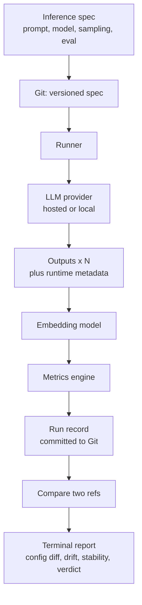

# AI Behavior Versioning — Hackathon Project Plan

> Pitch: "We version code, but not AI behavior. This project versions the complete inference specification in Git and measures semantic drift, stability, and regressions across versions, so every behavioral change can be attributed to a specific configuration change."

Goal: Deliver a working command-line tool in under one day that versions the full inference specification, executes it locally, and quantifies how AI behavior differs between two versions while attributing each change to its cause.

---

## 1. Scope

Guiding principle for a one-day build: protect the minimum viable product (MVP) and defer every enhancement to the stretch list.

### MVP (required for the demonstration)
1. Define an inference specification as a single version-controlled file covering the prompt, the model identity and version, the sampling settings, and the evaluation configuration.
2. Execute the specification locally, drawing N samples per version (default N = 3).
3. Record all runtime inference metadata and store the run in Git, keyed to the commit of the specification that produced it.
4. Compare two versions (two Git references) and compute three signals: Output Difference, Semantic Drift, and Stability Score.
5. Present the results in the terminal: the configuration difference, the three metrics, and a verdict of Consistent, Behavior Drift, or Likely Regression.

### Stretch (only after the MVP is stable)
- Multiple test inputs aggregated into a suite-level score.
- Drift trend across more than two versions.
- Token-level difference highlighting.
- A regression gate that returns a non-zero exit code for use in automation.
- Run records stored as Git notes attached to specification commits.

### Out of scope
- Web application, browser interface, or hosted service.
- REST API, CORS, or client-server networking.
- Authentication, multi-user support, or a managed database.
- Model fine-tuning.

---

## 2. Architecture

The tool is a single local command-line application. Git is the versioning and storage backend. There is no server, no network API, and no web interface; all execution is local.



Pipeline: versioned specification, then runner, then language model, then outputs with runtime capture, then embedding, then drift and stability, then Git, then terminal report.

The unit of versioning is the inference specification. A version of AI behavior is a Git commit, or tag, of that specification together with the run record produced when it was executed.

---

## 3. Technology Stack

| Layer | Choice | Rationale |
|---|---|---|
| Command-line interface | Python with Typer and Rich | Rapid development; formatted tables and diffs in the terminal |
| Versioning and storage | Git, accessed through GitPython or subprocess | Provides history, diff, and blame without custom infrastructure |
| Inference | A provider interface over a hosted model (OpenAI) or a local runtime (Ollama), with a mock mode | Enables fully local or offline operation and isolates the model behind one interface |
| Embeddings | Built-in hashing embedder by default; sentence-transformers or a hosted model optionally | Required for semantic drift; the default keeps the tool fully offline with no model download |
| Metrics | numpy and difflib | Cosine similarity, variance, and text difference |
| Specification format | YAML (PyYAML) | Human-readable and diff-friendly under version control |

The language model and the embedder sit behind a single provider interface that includes a deterministic mock mode. This permits development without credentials and a reliable offline demonstration.

---

## 4. Versioned Inference Specification

Every input that determines model behavior at runtime is recorded so that no variable is left untracked. This is the foundation for establishing causality (Section 8).

A specification is a single YAML file under version control:

```yaml
# specs/summarization.yaml — a fully versioned inference specification
spec_version: 1
name: summarization
task: Summarize a customer support ticket

prompt:
  system: You are an assistant that writes concise summaries.
  template: |
    Summarize the following ticket:

    {input}
  few_shot: []

model:
  provider: openai                  # openai | ollama | huggingface | ...
  name: gpt-4o-mini
  version: gpt-4o-mini-2024-07-18   # pinned snapshot, never a floating alias
  revision: null                    # model commit or revision hash for open-weight models

sampling:
  temperature: 0.2
  top_p: 1.0
  max_tokens: 256
  frequency_penalty: 0.0
  presence_penalty: 0.0
  stop: null
  seed: 7                           # pinned for reproducibility

evaluation:
  embedding_model: all-MiniLM-L6-v2
  samples: 3                        # N samples per version, used for stability
  thresholds:
    drift_warn: 0.15
    drift_fail: 0.40

inputs:
  - "My order #123 never arrived and support has not replied in a week."
```

Tracked fields, by category:
- Prompt: the system prompt, the user template, and any few-shot examples.
- Model identity: the provider, the model name, a pinned model version or snapshot, and, for open-weight models, the model commit or revision hash. Floating aliases are prohibited because they change silently.
- Sampling and decoding: temperature, top_p, maximum tokens, penalties, stop sequences, and the random seed.
- Evaluation configuration: the embedding model, the sample count, and the verdict thresholds.
- Inputs: the test input or inputs.

### What is tracked

The specification (versioned in Git) and the runtime capture (recorded at execution) together cover every input to inference:


Everything above the runtime boundary is versioned in the specification file; the runtime capture is written into the run record at execution and committed alongside it.

---

## 5. Runtime Capture and Git Storage

Execution records every observable property of the inference at runtime. The run record is committed to Git and keyed to the commit of the specification that produced it.

Run record, committed under `runs/<spec-commit>/<spec-name>/result.json`:

```json
{
  "spec": "summarization",
  "spec_commit": "a1b2c3d",
  "run_id": "2026-06-24T10:15:00Z-01",
  "runtime": {
    "model_version": "gpt-4o-mini-2024-07-18",
    "model_revision": null,
    "system_fingerprint": "fp_57db8e1f",
    "seed": 7,
    "embedding_model": "all-MiniLM-L6-v2",
    "library_versions": { "openai": "1.40.0", "numpy": "2.1.0" }
  },
  "samples": [
    { "output": "...", "tokens": 142, "latency_ms": 530 }
  ],
  "metrics": { "stability": 0.92 }
}
```

Captured runtime fields include the resolved model version and revision, the provider's system fingerprint (which detects server-side model changes), the seed actually used, token usage and latency per sample, the embedding model, and the versions of the libraries involved.

Repository layout, with Git as the backend:

```
specs/
  summarization.yaml          # versioned inference specification
runs/
  <spec-commit>/
    summarization/
      result.json             # outputs, runtime metadata, metrics
evals/
  config.yaml                 # shared thresholds and defaults (optional)
```

Because specifications and run records are ordinary files in Git, history, diff, and blame are available directly. Comparing two versions means comparing two Git references; the tool does not reimplement version control.

---

## 6. Metric Definitions

Outputs are embedded as vectors and compared with cosine similarity, cos(a, b) = (a . b) / (||a|| ||b||).

- Output Difference (text level): diff = 1 - SequenceMatcher(text_a, text_b).ratio(), where 0 indicates identical text and 1 indicates entirely different text.

- Semantic Drift (meaning level), the distance between the mean embedding of each version's outputs:
  $$\text{drift} = 1 - \cos\big(\bar{e}_{A},\ \bar{e}_{B}\big), \qquad \bar{e}_{V} = \frac{1}{N}\sum_{i=1}^{N} e_{V,i}$$
  Low drift indicates unchanged behavior; high drift indicates changed behavior.

- Stability Score (consistency of one version across N samples), the mean pairwise self-similarity:
  $$\text{stability}_V = \frac{2}{N(N-1)} \sum_{i<j} \cos\big(e_{V,i},\, e_{V,j}\big)$$
  A high score indicates reliable, repeatable output; a low score indicates variable output.

- Verdict, using the thresholds defined in the specification:
  - drift below 0.15: Consistent
  - drift from 0.15 up to 0.40: Behavior Drift
  - drift of 0.40 or above, or a substantial decrease in stability: Likely Regression

---

## 7. Command-Line Interface

The interface follows the Git model so that the workflow is familiar.

| Command | Git analogue | Purpose |
|---|---|---|
| `aiver init` | `git init` | Initialize the behavior repository and the example specification |
| `aiver status` | `git status` | Show whether the working specification differs from the last committed snapshot |
| `aiver commit` | `git commit` | Execute the specification, capture runtime metadata, and record a behavior snapshot |
| `aiver log` | `git log` | List the history of behavior snapshots |
| `aiver show <ref>` | `git show` | Show a version's specification, runtime capture, and metrics |
| `aiver diff <refA> <refB>` | `git diff` | Compare two versions: configuration difference, output difference, semantic drift, stability, and verdict |
| `aiver blame <refA> <refB>` | `git blame` | Attribute a behavioral change to the configuration difference (Section 8) |
| `aiver tag <name> [ref]` | `git tag` | Name a version, for example `v1` or `v2` |
| `aiver checkout <ref>` | `git checkout` | Restore the working specification to a version |

All output is rendered in the terminal. There is no web or graphical interface.

Example session:

```
$ aiver commit -m "baseline" --tag v1
Behavior committed  a1b2c3d09f   stability 0.92

$ aiver commit -m "raise temperature" --tag v2
Behavior committed  b2c3d4e1a0   stability 0.71

$ aiver diff v1 v2
Configuration difference
  sampling.temperature: 0.2 -> 0.9
Output difference: 0.41
Semantic drift:    0.27   (warn)
Stability:         A 0.92  ->  B 0.71
Verdict: Behavior Drift

$ aiver blame v1 v2
Cause:  the change is attributable to sampling.temperature
Effect: drift 0.27, stability change -0.21 -> Behavior Drift
```

---

## 8. Establishing Causality

Model behavior is a function of the complete inference specification plus irreducible sampling noise. When every input is versioned, the only unexplained variation between two runs of the same specification is sampling noise, which the Stability Score measures directly. This makes behavioral change attributable rather than mysterious.

Principles:
- Total capture: the prompt, the model identity and version, the sampling settings, the evaluation configuration, the inputs, and the library versions are all recorded. Nothing that influences behavior is left outside version control.
- Attribution: when metrics change between two references, the tool computes the specification difference and presents the behavioral delta beside the configuration delta. When exactly one field changed, that field is the cause.
- Controlled comparison: to support a rigorous causal claim, vary a single field per commit. When more than one field differs, the tool marks the comparison as confounded and lists every change.
- Determinism controls: pin the seed and pin the model snapshot version, and avoid floating aliases that update silently. Record the provider's system fingerprint to detect server-side model changes that would otherwise appear as unexplained drift.
- Behavior versus evaluation: because the evaluation configuration is versioned alongside the model configuration, a change in measured results can be correctly attributed either to a change in behavior or to a change in how behavior is measured.

This attribution capability is the central contribution. It converts an opaque observation, that the output changed, into a precise statement, that the output changed because a specific configuration value changed.

---

## 9. Hour-by-Hour Timeline

Approximately eight to nine hours, organized by component and parallelizable across two to four contributors.

| Time | Versioning and runtime | Metrics and interface |
|---|---|---|
| 0:00-1:00 | Define the specification schema; implement the Git layer and `aiver init` | Scaffold the CLI with Typer and Rich; implement the mock provider |
| 1:00-2:30 | Runner: N samples and full runtime capture; commit run records | Embedding integration with batched calls |
| 2:30-3:30 | `aiver commit` end to end; seed example specifications | Metrics engine: difference, drift, stability, verdict |
| 3:30-4:30 | Specification diff and run lookup across Git references | `aiver diff` report rendering in the terminal |
| 4:30-6:00 | `aiver blame` attribution and confounded-comparison detection | `aiver log` and `aiver show` |
| 6:00-7:00 | Edge cases; threshold tuning; prepare a clear demonstration example | Output polish: tables, colors, and wording |
| 7:00-8:00 | Stretch: Git notes or multiple inputs | Stretch: drift trend across versions |
| 8:00-9:00 | Demonstration rehearsal and buffer | Demonstration rehearsal |

Enforce strict time boxes. If a component is not working by hour five, fall back to mock mode and preserve the demonstration.

---

## 10. Roles

- Versioning and runtime: the specification schema, the Git layer, the runner, and runtime capture.
- Metrics and causality: difference, drift, stability, thresholds, and the attribution view.
- Interface: the command-line commands, terminal rendering, and output polish.
- Presentation: the slide deck, the demonstration script, and time-keeping; assists other contributors as needed.

For a single contributor, implement the components in MVP order and rely on mock mode early.

---

## 11. Risks and Mitigations

| Risk | Mitigation |
|---|---|
| Credentials, rate limits, or cost | Use a small model, a small sample count, caching, mock mode, or a local model |
| Network failure during the demonstration | Use a local model or mock mode with seeded outputs, and pre-record a run |
| Embedding latency | Batch all embedding calls and use a small local embedding model |
| Metrics appear unconvincing | Select a specification pair with an obvious behavioral change for the demonstration |
| A confounded comparison undermines a causal claim | Enforce single-variable changes per commit and surface confounds explicitly |
| Scope creep | Freeze the stretch list until the MVP demonstrates cleanly |

---

## 12. Demonstration Script (approximately two minutes)

1. Context: code has Git, but AI behavior has no equivalent versioning layer.
2. Show specification version one and run it; display the outputs and metrics.
3. Change a single sampling field, for example the temperature, commit version two, and run it.
4. Run `aiver diff v1 v2` and `aiver blame v1 v2`: semantic drift rises and stability falls, attributed to the single configuration change.
5. Close: the tool versions the entire inference specification and attributes every behavioral change to a specific configuration change.

---

## 13. Quickstart

```bash
# Install
python -m venv .venv
.venv\Scripts\activate            # Windows
pip install -e .
pip install -e ".[openai]"        # optional, for hosted models
pip install -e ".[local]"         # optional, for local sentence-transformers embeddings

# Initialize and run
aiver init
aiver commit -m "baseline" --tag v1
# change one field in specs/summarization.yaml (for example, temperature), then:
aiver commit -m "experiment" --tag v2
aiver diff v1 v2
aiver blame v1 v2
```

The tool runs entirely offline by default (mock provider and a built-in hashing embedder). Set the provider to a local runtime (Ollama) for local models, or supply `OPENAI_API_KEY` only when using a hosted model.

---

## 14. Definition of Done (MVP)

- [ ] A specification captures the prompt, the model identity and version, the sampling settings, and the evaluation configuration.
- [ ] Execution records runtime metadata (model version and revision, system fingerprint, seed, library versions) and commits the run to Git, keyed to the specification commit.
- [ ] `aiver diff` reports the configuration difference, output difference, semantic drift, stability, and a verdict.
- [ ] `aiver blame` attributes a behavioral change to the configuration difference and flags confounded comparisons.
- [ ] The tool runs end to end offline through mock or local mode.
- [ ] A rehearsed two-minute demonstration that lands the closing statement.
