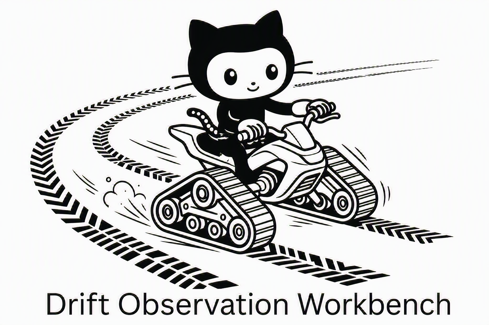

# dow - Drift Observation Workbench

<p align="center">
  
</p>

Track how your AI's behavior changes across versions. Version the complete
inference specification (prompt, model identity and version, sampling settings,
evaluation configuration), execute it, and measure semantic drift, stability, and
regressions between versions - with causal attribution. Versioning is automatic
and Git is a hidden storage backend; you never run git commands.

See [PROJECT_PLAN.md](PROJECT_PLAN.md) for the full design.

## Install

```bash
python -m venv .venv
.venv\Scripts\activate            # Windows
pip install -e .
```

Optional providers:

```bash
pip install -e ".[openai]"        # hosted models and embeddings
pip install -e ".[local]"         # local sentence-transformers embeddings
pip install -e ".[mcp]"           # Model Context Protocol server (dow-mcp)
```

## Use

```bash
dow init           # scaffold specs/summarization.yaml + evals.py
# edit specs/summarization.yaml (your prompt, model, sampling, metrics)
dow commit         # captures v1
# edit specs/summarization.yaml again (e.g. change temperature)
dow commit         # captures v2 (custom metrics run automatically)
dow compare        # v1 vs v2: output diff + drift + stability + verdict (defaults to last two)
dow explain        # why behavior changed: attributes it to a config field
dow tag good v1    # label a version (good, golden, baseline, bad, ...)
dow eval           # run your custom metrics; compare vs previous and last-good
dow history        # list captured versions, stability, and tags
dow inspect v1     # one version's spec, runtime capture, outputs, tags, eval
dow tree           # visualize how behavior evolves across versions
dow tree -o evolution.md   # export a Mermaid diagram; open the Markdown preview
```

Versions are named automatically (v1, v2, ...); refer to them by name, the
shortcuts `last` and `prev`, or any label you applied with `dow tag`. They form
a tree - `dow commit --from v1` branches from an earlier version. Runs fully
offline by default (mock provider + built-in hashing embedder); no API key
required.

## Custom metrics

Plug in your own evaluators - plain functions that receive an `EvalContext` and
return a score or named scores - and reference them from the spec:

```yaml
evaluation:
  metrics:
    - evals.py:avg_word_count      # local file : function
    - my_pkg.metrics:accuracy      # importable module : function
```

```python
# evals.py
def avg_word_count(ctx):
    return sum(len(o.split()) for o in ctx.outputs) / max(1, len(ctx.outputs))
```

`dow eval` runs them, saves the scores with the version, and compares against
the previous version and the last one you tagged (`dow tag good`). Evaluation
is automatic on `dow commit` and reused thereafter unless you pass `--rerun`.

## MCP server

Prefer to drive dow from an AI agent? `dow-mcp` exposes the core workbench over
the [Model Context Protocol](https://modelcontextprotocol.io) (stdio), so an MCP
client can scaffold specs, capture versions, and compare/explain drift on your
behalf. It runs on the same engine as the CLI - both call into
[dow/service.py](dow/service.py), so the two surfaces never drift apart - and
works fully offline by default (mock provider + built-in embedder).

```bash
pip install -e ".[mcp]"   # or: pip install "dow[mcp]"
dow-mcp                    # serve over stdio (usually launched by your MCP client)
```

Point an MCP client at the `dow-mcp` command and set the project directory it
should operate on:

```json
{
  "mcpServers": {
    "dow": {
      "command": "dow-mcp",
      "env": { "DOW_PROJECT_DIR": "/path/to/your/project" }
    }
  }
}
```

Each tool resolves its project directory from the `project_dir` argument, else
the `DOW_PROJECT_DIR` environment variable, else the server's current directory.
The 13 tools mirror the CLI: `dow_list_specs`, `dow_init`, `dow_read_spec`,
`dow_write_spec`, `dow_commit`, `dow_compare`, `dow_explain`, `dow_eval`,
`dow_history`, `dow_inspect`, `dow_tag`, `dow_tree`, and `dow_docs`. They return
structured JSON (drift scores, verdicts, config diffs, metrics, the version
tree, and Mermaid), so a client can run the full edit -> commit -> compare loop.

## Documentation and the manual page

Each command's description and examples live in a single editable text file under
`dow/docs/<command>.txt`. That one source feeds both `dow help <command>` (in the
terminal) and the Unix man page, so they never drift apart. To document a new command
or revise an existing one, edit (or add) its `dow/docs/<command>.txt` - no code changes
needed - and both surfaces update automatically. (Options and arguments are read from
the command's own definition, so those stay correct on their own.)

`dow` also ships a Unix man page generated from those docs:

- On Linux, macOS, or WSL, run `man dow` for the full documentation. A regular
  `pip install` places the page on the man path; for an editable install
  (`pip install -e .`), run `dow man --install` once to copy it to
  `~/.local/share/man/man1`.
- `dow man` prints the page (roff) to stdout - pipe it anywhere, e.g. `dow man | less`.
- After editing docs, refresh the committed page with `dow man --install --dir man`.

On Windows PowerShell, `man` is an alias for `Get-Help` and will not render this
page; use WSL or Git Bash for `man dow`, or read it directly with `dow man`.
